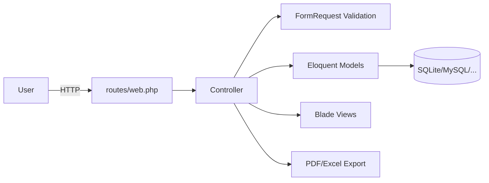

# 01 – Architektur

## High-Level
Monolithische Laravel-Webanwendung (Server-rendered Blade Views). Domäne basiert auf relationalen Kernobjekten:
- Customer
- Device
- Inspection
- Measurement
- TestDevice

## Komponenten und Verantwortungen
- `routes/web.php`: HTTP-Routing, zentrale Use-Cases.
- `app/Http/Controllers/*`: Orchestrierung (CRUD, Import, Export, Report, Auth, User-Admin).
- `app/Http/Requests/*`: Input-Validierung.
- `app/Models/*`: Eloquent-Modelle + Beziehungen.
- `app/Services/St725CsvParser.php`: CSV-Normalisierung ST725.
- `app/Services/InventoryNumberGenerator.php`: Inventarnummern-Generierung.
- `resources/views/*`: UI-Templates + PDF-Templates.
- `database/migrations/*`: Schema-Definition.

## Datenfluss (Hauptflow)

## Auth/Permissions-Konzept
- Fast alle Business-Routen liegen in `Route::middleware('auth')`.
- Öffentlich ist explizit `GET /public/device/{device}`.
- Registrierung ist per Setting `registration_enabled` schaltbar (`settings` Tabelle + `setting()` Helper).
- **Keine fein-granularen Rollen/Policies im Code gefunden** -> `UNBEKANNT / FEHLT`.

## Error-Handling / Retries
- Kein projektspezifischer globaler Exception-Handler konfiguriert (nur Laravel-Standard in `bootstrap/app.php`).
- Queue-Listener wird im Dev-Script mit `--tries=1 --timeout=0` gestartet.
- Zusätzliche Retry-Strategien für Integrationen: `UNBEKANNT / FEHLT`.

## Observability
- Logging via Laravel Logging-Stack (`config/logging.php`).
- `storage/logs/laravel.log` (single/daily je Konfiguration).
- Keine projekt-spezifischen Metrics/Tracing-Integrationen gefunden -> `UNBEKANNT / FEHLT`.

## Kritische Abhängigkeiten
- `laravel/framework`
- `barryvdh/laravel-dompdf` (Berichte)
- `maatwebsite/excel` (Exporte)
- `simplesoftwareio/simple-qrcode` (QR-Workflows)
- `vite` + `tailwindcss` (Frontend-Build)

## Media-Flow für Devices & Prüfgeräte
Neuer Teilfluss für polymorphe Medien:
1. UI (`devices/show.blade.php` und `test_devices/show.blade.php`) startet Upload via Drag&Drop oder Dateiauswahl.
2. Upload trifft `MediaController` (Device- und Prüfgeräte-Routen).
3. Validierung prüft MIME/Dateityp/Dateigröße.
4. `MediaService` speichert Datei im `public`-Storage, erzeugt bei Bildern ein Thumbnail und markiert automatisch das erste Bild je Entity als Hauptbild.
5. Persistenz in Tabelle `device_media` über polymorphe Felder `mediable_type` + `mediable_id`.
6. Anzeige:
   - Hauptbild-Icon in Listen (Device und Prüfgerät).
   - Gemeinsame Slideshow-Komponente (`resources/views/media/manager.blade.php`) für Detailseiten.

## Legacy-Hinweis
`device_id` bleibt aus Kompatibilitätsgründen in `device_media` erhalten (nullable), neue Logik nutzt `mediable_*`.

## Responsive-Architektur (Desktop/Tablet/Mobile)
- Desktop (>=1200px): bestehendes Layout bleibt unverändert; responsive Erweiterungen greifen nur unterhalb Desktop-Breakpoints.
- Tablet (768-1199px): kompaktere Tabellenabstände (`tablet-compact`) und größere Touch-Ziele (`touch-target`).
- Mobile (<=767px): tabellarische Übersichten werden als Karten (`responsive-table-card`) dargestellt; Aktionsleisten stacken vertikal (`mobile-stack-actions`).
- Formulare nutzen `mobile-form` für größere Inputs/Buttons (44px+).
- Medienbereich (`media/manager.blade.php`) wurde für Swipe, größere Controls und Mobile-Action-Stack erweitert.
- PWA-Light: Manifest + Mobile-Meta-Tags im Hauptlayout (`layouts/app.blade.php`) für Homescreen-Installation.

## Sidebar Responsive Verhalten (Navigation)
- Desktop (`>=1024px` / `lg`): Sidebar bleibt wie bisher dauerhaft sichtbar; Breitenumschaltung (breit/schmal) bleibt aktiv.
- Mobile/Tablet (`<1024px`): Sidebar startet ausgeblendet und wird als Off-Canvas von links eingeblendet (`translateX`-Animation).
- Öffnen erfolgt über einen mobilen Hamburger-Button (`☰`) links in der Topbar.
- Beim Öffnen wird ein halbtransparentes Vollbild-Overlay angezeigt; Klick auf Overlay oder Close-Button schließt die Sidebar.
- Ziel: keine blockierende Dauerüberlagerung des Inhalts auf Touch-Geräten, Desktop-Verhalten bleibt unverändert.

