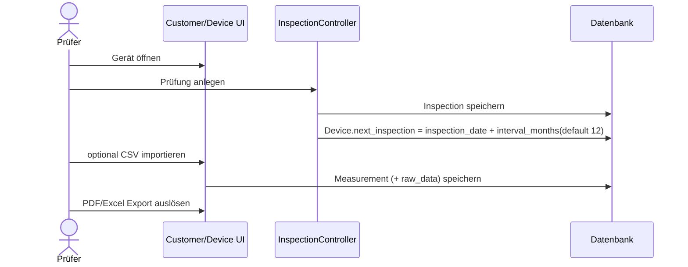

# 09 – Business-Logik

## Kernprozesse
1. Kunde erfassen (`CustomerController`).
2. Gerät einem Kunden zuordnen (`DeviceController@store`).
3. Prüfung für Gerät erfassen (`InspectionController@store`).
4. Messwerte manuell oder via ST725-Import erfassen (`ImportController`).
5. Nächsten Prüftermin automatisch berechnen (`InspectionController`, `ImportController`).
6. Bericht/Export erzeugen (`ReportController`, `DeviceController` Exportmethoden).

## Wichtigster End-to-End-Flow

## Entscheidungslogik / Sonderfälle
- `interval_months` fehlt -> Default 12 Monate.
- Prüfnorm in `InspectionController@update`: mit `is_welder` => `DIN EN 60974-4`, sonst `DIN VDE 0701-0702`.
- CSV-Ergebnis wird normalisiert (`ok/passed/i.o.` => bestanden).
- Import ignoriert Zeilen ohne Device-Mapping.

## Code-Lokation der zentralen Logik
- Routen: `routes/web.php`
- Prüfungen: `app/Http/Controllers/InspectionController.php`
- Import: `app/Http/Controllers/ImportController.php`
- CSV Parsing: `app/Services/St725CsvParser.php`
- Report: `app/Http/Controllers/ReportController.php`
- Inventory Nummern: `app/Services/InventoryNumberGenerator.php`

## Unklare Domänenregeln
- Freigabe-/Review-Prozess für Prüfungen im Sinne 4-Augen-Prinzip -> `UNBEKANNT / FEHLT`.
- Mandanten-/Rollenkonzept pro Kunde -> `UNBEKANNT / FEHLT`.

## Medienlogik (DeviceMedia)
- Upload akzeptiert Bilder und Videos in einem Request.
- Für Bilder wird serverseitig eine Thumbnail-Variante erzeugt (quadratisch, komprimiert als WebP).
- Es darf fachlich genau ein Hauptbild geben:
  - Beim ersten Bild-Upload wird `is_primary=true` gesetzt.
  - Beim Setzen eines neuen Hauptbilds werden andere Einträge auf `false` gesetzt.
  - Wird das Hauptbild gelöscht, wird das neueste verbleibende Bild automatisch Hauptbild.
- Anzeigepriorität:
  1. `primaryMedia` für kompaktes Icon in Übersichten.
  2. Vollständige, gemischte Medienliste (Bild/Video) in der Detail-Slideshow.
